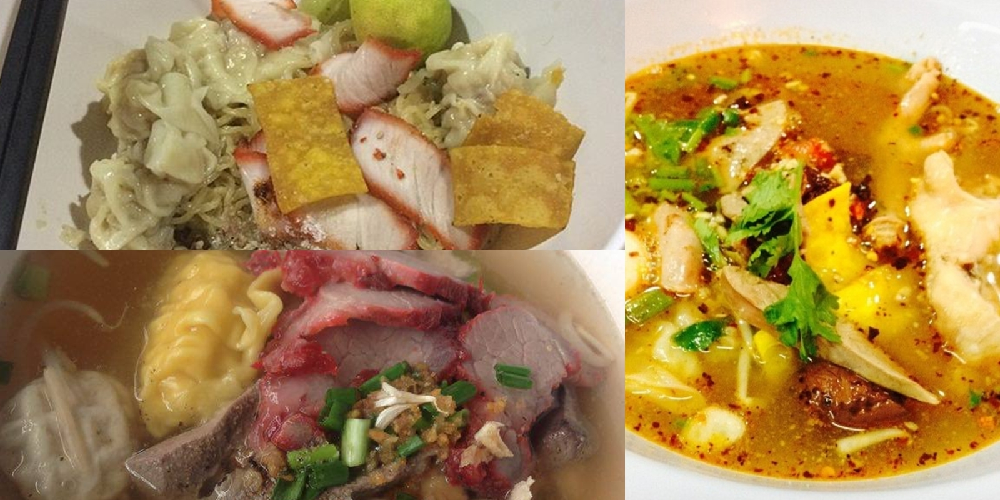
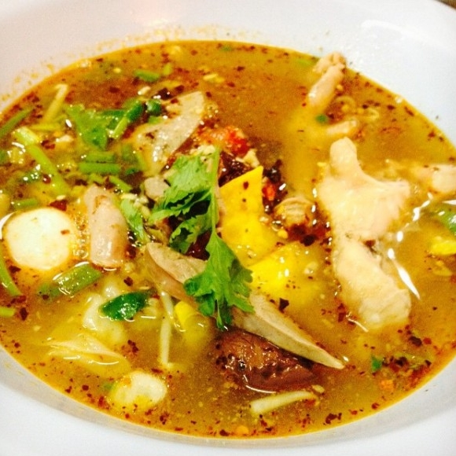
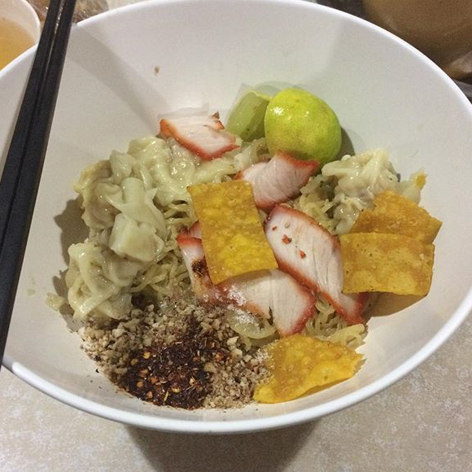
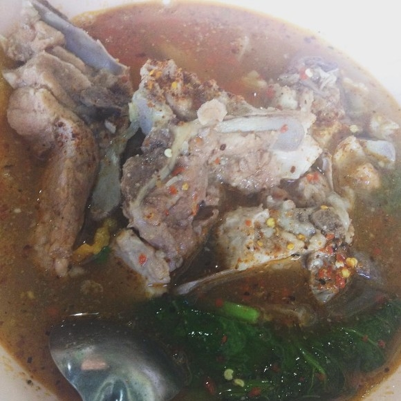
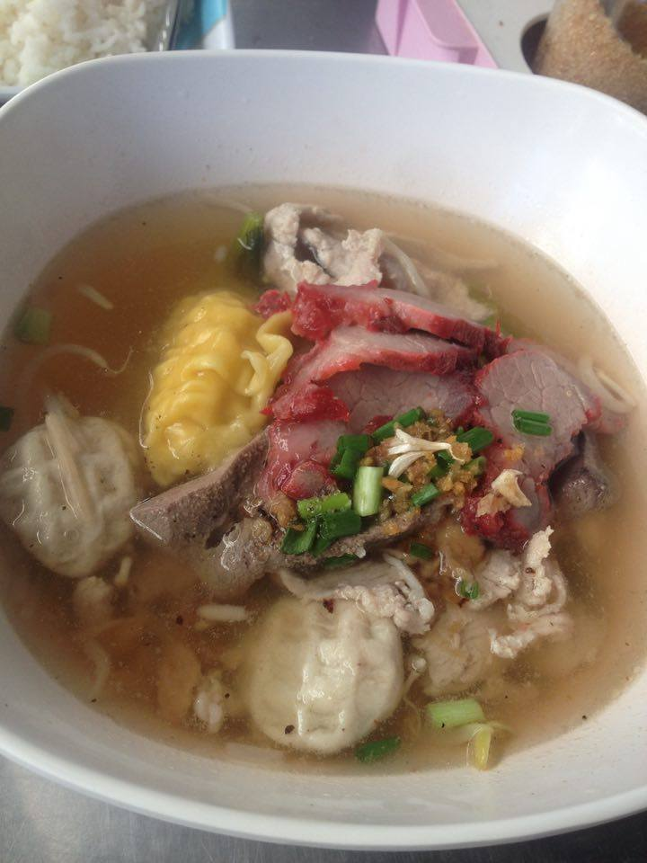
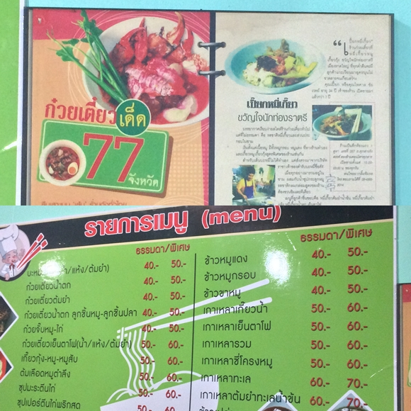

# <html>
<title>เปี๊ยกราชาบะหมี่เกี๊ยว</title>
<meta charset="UTF-8">
<meta name="viewport" content="width=device-width, initial-scale=1">
<link rel="stylesheet" href="https://www.w3schools.com/w3css/4/w3.css">

<!-- Navbar (sit on top) -->

  

   <a href="https://golfmanaza.github.io/10yummyfoodinHDY/" class="w3-card-4 w3-xxlarge  w3-hover-red">10ร้านห้ามพลาดในหาดใหญ่</a>

      <a href="#about" class="w3-bar-item w3-display-container w3-content w3-wide w3-button w3-card-4 w3-border w3-hover-orange">ร้าน</a>
      <a href="#menu" class="w3-display-container w3-content w3-wide w3-bar-item w3-button w3-card-4 w3-border w3-hover-green">ข้อมูลร้าน</a>
	
  

<!-- Header -->
<header class="w3-display-container w3-content w3-wide" style="max-width:1600px;min-width:500px" id="home">
  
  

    <h1 class="w3-xlarge w3-animate-left w3-card-4">"เปี๊ยกราชาบะหมี่เกี๊ยว" </h1>
  

</header>

<!-- Page content -->

  <!-- About Section -->
  

    

     
    

    

      <h1 class="w3-center w3-animate-left w3-card-4 w3-border w3-hover-red ">เปี๊ยกราชาบะหมี่เกี๊ยว</h1>

      <h5 class="w3-center">ขวัญใจนักท่องราตรี </h5>
      
ร้านเปี๊ยก ราชาบะหมี่เกี๊ยว  เริ่มต้นจากร้านเล็กๆ  จนกลายเป็นร้านห้องแถว 2 ห้อง 
	  ขายมานานเหมือนกัน  บะหมี่ทำเอง  เกี๊ยวหมูชิ้นโต  หมูแดงก็อร่อย
	  นอกจากนี้ยังมีเมนูเด็ดๆ อีกมากมายเช่น ข้าวหมูกรอบ หมูแดง 
	  ต้มหมูใบตำลึง  เมนูเยอะมากๆครับ  ร้านนี้เปิดกันเกือบตลอด 24 ชั่วโมงเลยค่ะ 

ต้องลอง ! บะหมี่เกี๊ยว,เกาเหลาซี่โครงหมู,เกี๊ยวน้ำ,หมี่เหลืองแห้งต้มยำ 
	  

  

  <!-- Menu Section -->

  

    

      <h1 class="w3-center w3-card-4 w3-border w3-hover-red">ข้อมูลร้าน</h1>
      <h4>เวลาเปิดร้าน</h4>
      
เปิดบริการทุกวันตั้งแต่เวลา 06.00-04.00น.

      <h4>ที่ตั้งและบรรยากาศ</h4>
      
ถ.ศุภสารรังสรรค์ (ช่องเขา-ม.อ สามสิบเมตร)

      <h4>ช่วงราคา</h4>
      
35–70บาท

      <h4>เบอร์ติดต่อ</h4>
      
0849689014

      <h4>ข้อมูลอื่นๆ</h4> 
      
จอดรถริมถนนหน้าร้าน 
  	อาหารราคาถูก อร่อย 
	มี Wifi บริการ 

    

    

      
    

  

  

<!-- End page content -->

  <h2>รูปภาพเพิ่มเติม</h2>
  
ชมบรรยากาศและอาหาร

 
  
  

  

  

  
  

  

 
  
  

  

  

 
  
  

  

  

 
  
  

  

  

<button class="w3-button w3-display-left w3-black" onclick="plusDivs(-1)">&#10094;</button>
<button class="w3-button w3-display-right w3-black" onclick="plusDivs(1)">&#10095;</button>

<!-- Footer -->
<footer class="w3-center w3-light-grey w3-padding-32 w3-card-3 ">
  
ชมภาพอาหารจากร้านต่าง<a href="https://www.instagram.com/explore/tags/eatstylegob/" title="W3.CSS" target="_blank" class="w3-hover-text-green">INSTAGRAM #EATSTYLEGOB</a>

</footer>
